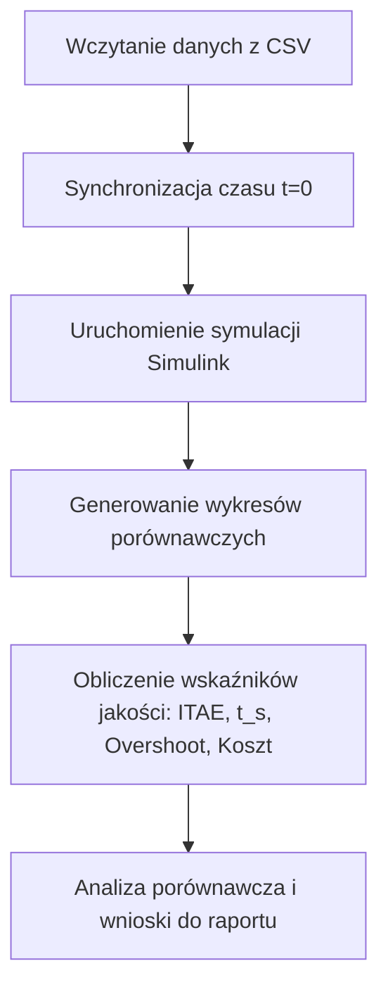

# Metodyka Badań Porównawczych: Obiekt Rzeczywisty vs Modele Matematyczne

Ten dokument opisuje krok po kroku metodologię walidacji modeli (teoretycznego i doświadczalnego) systemu *Ball on Beam* w układzie zamkniętym.

---

## 1. Wybór danych pomiarowych (Pliki CSV)

**Rekomendacja:** Do badań należy wybrać **dokładnie 2 przebiegi**:
1. **ROZNICA1 (Skok w GÓRĘ)**: np. zmiana wartości zadanej z 50 mm na 150 mm.
2. **ROZNICA2 (Skok w DÓŁ)**: np. zmiana wartości zadanej z 150 mm na 50 mm.

**Dlaczego dwa, a nie jeden?**
* **Asymetria fizyczna**: Ze względu na grawitację, asymetrię mechaniczną dźwigni, naprężenia kabli czy ustawienie czujnika ToF, kulka może zachowywać się nieco inaczej przy toczeniu w lewo niż w prawo. Dwa przeciwne skoki eliminują podejrzenie o "cherry-picking" (wybiórcze dopasowanie pod tezę) i pokazują pełną charakterystykę obiektu.

---

## 2. Krok po kroku: Plan Realizacji Badań

### Krok 1: Przygotowanie danych z obiektu (Pre-processing)
1. Wczytaj pliki CSV do MATLABa.
2. **Synchronizacja czasu**: Znajdź moment, w którym nastąpił skok wartości zadanej (setpoint). Odejmij ten czas od całego wektora czasu, tak aby moment skoku odpowiadał dokładnie $t = 0$.
3. **Usunięcie offsetu sterowania**: Jeśli sygnał sterujący w CSV ma offset (np. oscyluje wokół 100°), odejmij go ($u - 100$), aby reprezentował odchylenie od poziomu (zgodnie z modelami LTI).

### Krok 2: Konfiguracja i uruchomienie symulacji w Simulinku
1. W Simulinku zaimplementuj zamkniętą pętlę sterowania z regulatorem o **dokładnie takich samych nastawach ($K_p, K_i, K_d$)**, jakie były wgrane na STM32 podczas rzeczywistego eksperymentu.
2. Pamiętaj o spójności struktur (regulator równoległy) i przeliczeniu nastaw ze względu na okres próbkowania $T_s$:
   * $K_{p\text{\_Sim}} = K_{p\text{\_STM}}$
   * $K_{i\text{\_Sim}} = K_{i\text{\_STM}} / T_s$
   * $K_{d\text{\_Sim}} = K_{d\text{\_STM}} \cdot T_s$
3. Przeprowadź symulację dla dwóch wariantów obiektu:
   * **Model teoretyczny**: $G(s) = \frac{20.55}{s^2(0.095s + 1)}$
   * **Model doświadczalny**: $G(s) = \frac{11.93}{s^2(0.095s + 1)}$
4. Wartość zadana (Step) w Simulinku musi mieć identyczną amplitudę i czas trwania jak w rzeczywistym eksperymencie.

### Krok 3: Wykresy porównawcze
Dla każdego z dwóch testów wygeneruj dwa wykresy na wspólnej osi czasu:
1. **Wykres Pozycji $y(t)$**: Porównanie przebiegu wartości zadanej, pozycji rzeczywistej (z CSV), odpowiedzi modelu teoretycznego oraz odpowiedzi modelu doświadczalnego.
2. **Wykres Sterowania $u(t)$**: Porównanie sygnału sterującego (kąta belki) z obiektu rzeczywistego oraz obu symulacji. Pozwala to ocenić, czy modele nie generują nierealistycznie dużych (nasyconych) sygnałów sterujących.

---

## 3. Wyznaczanie wskaźników jakości (Porównanie ilościowe)

Dla każdej z 3 krzywych (Obiekt, Teoria, Doświadczenie) należy wyznaczyć:

### 1. Przeregulowanie ($\kappa$)
Wskaźnik określający o ile procent kulka przekroczyła wartość zadaną przy pierwszym wahnięciu:
$$\kappa = \frac{y_{\max} - y_{\text{ustalone}}}{y_{\text{ustalone}} - y_{\text{początkowe}}} \cdot 100\%$$

### 2. Czas regulacji ($t_s$ - settling time)
Czas, po którym kulka wpada do tzw. **tunelu tolerancji** (np. $\pm 5\%$ lub $\pm 2\%$ amplitudy skoku) wokół wartości zadanej i już z niego nie wypada.
* *Przykład*: Dla skoku o 100 mm, tunel $\pm 5\%$ wynosi $\pm 5\text{ mm}$ wokół setpointu.

### 3. Wskaźnik całkowy ITAE
Miara dokładności regulacji w czasie, mocniej karząca uchyby trwające długo:
$$\text{ITAE} = \int_{0}^{T} t \cdot |e(t)| \, dt \approx \sum_{k=2}^N t_k \cdot |e_k| \cdot \Delta t_k$$

### 4. Koszt sterowania ($J_u$)
Wskaźnik oceniający zużycie energii i dynamiczne obciążenie serwa:
$$J_u = \int_{0}^{T} (u(t) - u_{\text{neutral}})^2 \, dt \approx \sum_{k=2}^N (u_k - u_{\text{neutral}})^2 \cdot \Delta t_k$$

---

## 4. Oczekiwane wnioski do raportu

* **Zbieżność modeli**: Model doświadczalny (ze wzmocnieniem ok. 11.93) powinien wykazać znacznie większą zgodność z obiektem rzeczywistym niż model teoretyczny (wzmocnienie 20.55), ze względu na uwzględnienie oporów ruchu i strat mechanicznych w identyfikacji.
* **Wpływ nieliniowości**: Rzeczywisty obiekt może mieć dłuższy czas regulacji ($t_s$) oraz drobny uchyb ustalony z powodu **tarcia statycznego (stiction)**, którego nie opisują liniowe modele transmitancyjne.
